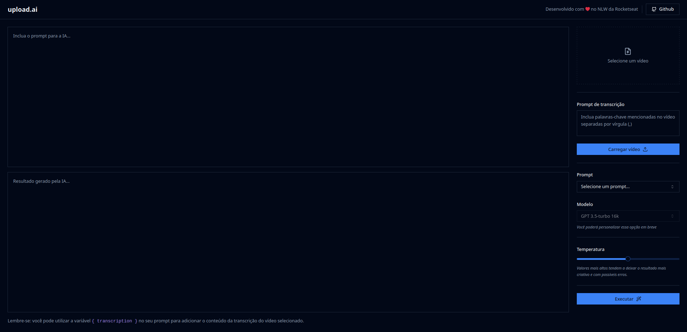

<h1 align="center" style="text-align: center;">
  upload.ai
</h1>

<p align="center">
  
  </img> 
  </img>
  </img>
  </img>
</p>

> Projeto desenvolvido na Trilha Mastery da NLW IA da Rocketseat.

<h2 id="project">📁 Projeto</h2>

<p>
O projeto permite aos usuários fazer upload de vídeos e, por meio de IA, gerar automaticamente títulos e descrições para vídeos do YouTube a partir da transcrição do conteúdo.
</p>

<p>Neste repositório estão disponíveis tanto o front-en como o back-end.</p>

<p align="center">
    
</p>

## :computer: Tecnologias
* [Node.js](https://nodejs.org/en/)
* [Typescript](https://www.typescriptlang.org/)
* [React](https://reactjs.org/)
* [TailwindCSS](https://tailwindcss.com/)
* [Prisma](https://www.prisma.io/)
* [Fastify](https://fastify.dev/)
* [shadcn/ui](https://ui.shadcn.com/)
* [OpenAI](https://platform.openai.com/docs/introduction)
* [Zod](https://zod.dev)


<a name="HowToRun" />

## 📋 Utilização

### 🖥 API
```shell
$ cd upload-ai-api
$ yarn
$ npx prisma generate
$ npx prisma migrate dev
$ yarn prisma db seed 
$ yarn dev
```
Crie um arquivo **.env** e adicione a seguinte informação:
```shell
OPENAI_KEY=<YOUR_OPENAI_KEY>
```
### 🌐 Website
```shell
$ cd upload-ai-web
$ yarn
$ yarn dev
```

## 📝 Licença

Esse projeto está sob a licença MIT. Veja o arquivo [LICENSE](LICENSE) para mais detalhes.

